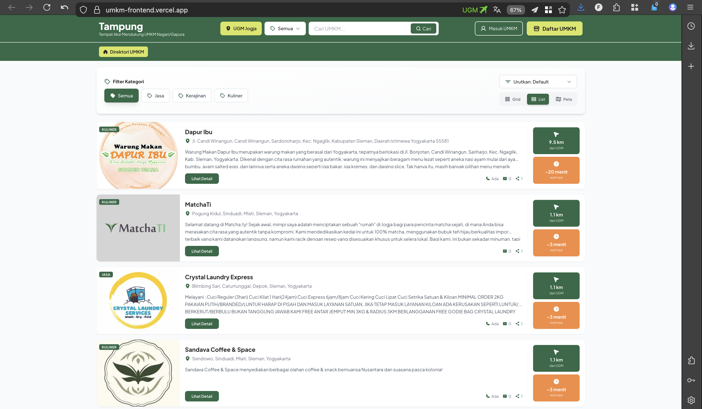
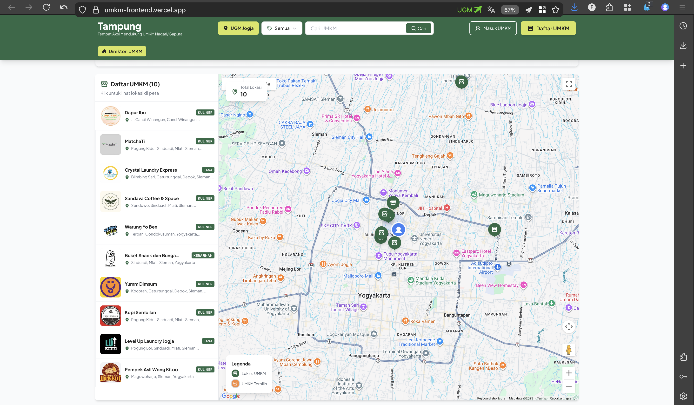

<div align="center">

# Tampung

<p align="center">
  <strong>Tempat Aksi Mendukung UMKM Nagari/Gapura</strong>
</p>

<p align="center">
  
  
  
  
  
</p>

<p align="center">
  Platform direktori UMKM yang memudahkan masyarakat menemukan dan mendukung<br/>usaha mikro, kecil, dan menengah lokal di Indonesia.<br/>Dilengkapi dengan peta interaktif, pencarian cerdas, dan dashboard manajemen UMKM.
</p>

<p align="center">
  <a href="#-fitur-utama">Fitur</a> •
  <a href="#-screenshot">Screenshot</a> •
  <a href="#-instalasi">Instalasi</a> •
  <a href="#-cara-penggunaan">Penggunaan</a> •
  <a href="#-demo">Demo</a>
</p>

</div>

---

## 📋 Daftar Isi

- [✨ Fitur Utama](#-fitur-utama)
- [🖼️ Screenshot](#-screenshot)
- [🚀 Demo](#-demo)
- [🏗️ Teknologi](#-teknologi)
- [📦 Instalasi](#-instalasi)
- [⚙️ Konfigurasi](#-konfigurasi)
- [🎯 Cara Penggunaan](#-cara-penggunaan)
- [🗂️ Struktur Project](#-struktur-project)
- [🔌 API Endpoints](#-api-endpoints)
- [🎨 Customization](#-customization)
- [🤝 Kontribusi](#-kontribusi)
- [📄 Lisensi](#-lisensi)

---

## ✨ Fitur Utama

### 🎯 Fitur Utama Platform

- **🔍 Pencarian Cerdas**: Sistem pencarian real-time dengan autocomplete dan filter kategori
- **📍 Lokasi Berbasis GPS**: Menampilkan jarak dan estimasi waktu tempuh dari lokasi pengguna
- **🗺️ Peta Interaktif**: Integrasi Google Maps untuk visualisasi lokasi UMKM
- **📱 Responsive Design**: Tampilan optimal di semua perangkat (desktop, tablet, mobile)
- **🎨 Multiple View Modes**: Grid view, list view, dan map view untuk kenyamanan browsing
- **🎯 Filter & Sorting**: Filter berdasarkan kategori, jarak, dan waktu tempuh
- **🚀 Onboarding Tour**: Interactive tour untuk pengguna baru (first-time experience)

### 👥 Fitur untuk Pengguna

- **🔐 Autentikasi Aman**: Login dan registrasi dengan NextAuth.js
- **📊 Dashboard UMKM**: Panel kontrol untuk mengelola profil dan produk UMKM
- **🖼️ Galeri Produk**: Upload dan kelola foto produk UMKM
- **📝 Manajemen Profil**: Edit informasi UMKM, lokasi, kontak, dan deskripsi
- **⚡ Real-time Updates**: Perubahan data langsung ter-update tanpa reload

---

## 🖼️ Screenshot

<table>
  <tr>
    <td width="50%">
      <h3 align="center">🏠 Grid View</h3>
      <p align="center">
        
      </p>
      <p align="center">Tampilan grid dengan filter kategori dan pencarian cerdas</p>
    </td>
    <td width="50%">
      <h3 align="center">📋 List View</h3>
      <p align="center">
        
      </p>
      <p align="center">Tampilan list dengan informasi detail lengkap</p>
    </td>
  </tr>
  <tr>
    <td width="50%">
      <h3 align="center">🗺️ Map View</h3>
      <p align="center">
        
      </p>
      <p align="center">Peta interaktif dengan marker lokasi UMKM</p>
    </td>
    <td width="50%">
      <h3 align="center">📍 Detail UMKM</h3>
      <p align="center">
        
      </p>
      <p align="center">Halaman detail dengan hero image & navigasi</p>
    </td>
  </tr>
  <tr>
    <td width="50%">
      <h3 align="center">🖼️ Galeri Produk</h3>
      <p align="center">
        
      </p>
      <p align="center">Carousel galeri produk interaktif</p>
    </td>
    <td width="50%">
      <h3 align="center">👤 Dashboard UMKM</h3>
      <p align="center">
        
      </p>
      <p align="center">Panel kontrol untuk pemilik UMKM</p>
    </td>
  </tr>
  <tr>
    <td width="50%">
      <h3 align="center">✏️ Edit Profil</h3>
      <p align="center">
        
      </p>
      <p align="center">Halaman edit informasi & upload foto</p>
    </td>
    <td width="50%">
      <h3 align="center">🔐 Dashboard Admin</h3>
      <p align="center">
        
      </p>
      <p align="center">Dashboard administrator untuk kelola platform</p>
    </td>
  </tr>
</table>

---

## 🚀 Demo

🌐 **Live Demo**: [Tampung UMKM Platform](https://umkm-frontend.vercel.app)

> **Note**: Demo menggunakan data sample. Untuk production, pastikan menghubungkan dengan database yang sesuai.

### ✨ Fitur Demo:
- ✅ Pencarian real-time UMKM
- ✅ Filter kategori & lokasi
- ✅ Peta interaktif dengan Google Maps
- ✅ View mode: Grid, List, dan Map
- ✅ Onboarding tour untuk pengguna baru
- ✅ Dashboard UMKM (perlu login)

---

## 🏗️ Teknologi

### Core Framework
- **[Next.js 15.5.6](https://nextjs.org/)** - React framework dengan App Router
- **[React 19.1.0](https://react.dev/)** - Library UI terbaru
- **[TypeScript 5](https://www.typescriptlang.org/)** - Type-safe JavaScript

### Styling & UI
- **[Tailwind CSS 3.4](https://tailwindcss.com/)** - Utility-first CSS framework
- **[Phosphor Icons](https://phosphoricons.com/)** - Icon library yang fleksibel
- **[class-variance-authority](https://cva.style/docs)** - Utility untuk component variants

### State Management & Data
- **[NextAuth.js 4.24](https://next-auth.js.org/)** - Authentication untuk Next.js
- **Server Components** - Data fetching di server side
- **API Routes** - Built-in API dengan Next.js

### Maps & Location
- **[@vis.gl/react-google-maps](https://visgl.github.io/react-google-maps/)** - Google Maps integration
- **Google Maps API** - Geocoding dan distance calculation

### UI Components
- **[Radix UI](https://www.radix-ui.com/)** - Headless UI components
- **[Embla Carousel](https://www.embla-carousel.com/)** - Carousel/slider component
- **[React Toastify](https://fkhadra.github.io/react-toastify/)** - Toast notifications

### Development Tools
- **[Turbopack](https://turbo.build/pack)** - Ultra-fast bundler dari Vercel
- **[ESLint](https://eslint.org/)** - Linting dan code quality
- **[PostCSS](https://postcss.org/)** - CSS processing
- **[Autoprefixer](https://autoprefixer.github.io/)** - Vendor prefixes otomatis

---

## 📦 Instalasi

### Prerequisites

Pastikan Anda telah menginstall:
- **Node.js** 18.x atau lebih tinggi ([Download](https://nodejs.org/))
- **npm** atau **yarn** (package manager)
- **Git** ([Download](https://git-scm.com/))

### Langkah Instalasi

#### 1. Clone Repository

```bash
git clone https://github.com/your-username/umkm-frontend.git
cd umkm-frontend
```

#### 2. Install Dependencies

Menggunakan npm:
```bash
npm install
```

#### 3. Setup Environment Variables

Buat file `.env.local` di root project:

```bash
cp .env.example .env.local
```

Edit `.env.local` dengan konfigurasi Anda:

```env
# NextAuth Configuration
NEXTAUTH_URL=http://localhost:3000
NEXTAUTH_SECRET=your-secret-key-here

# API Configuration
NEXT_PUBLIC_API_URL=http://localhost:3000/api
NEXT_PUBLIC_BASE_URL=http://localhost:3000

# Google Maps API
NEXT_PUBLIC_GOOGLE_MAPS_API_KEY=your-google-maps-api-key

# Database (jika menggunakan database eksternal)
DATABASE_URL=your-database-url

# External API (jika ada)
EXTERNAL_API_URL=https://api.example.com
EXTERNAL_API_KEY=your-api-key
```

#### 4. Generate Secret Key

Generate secret key untuk NextAuth:

```bash
# Linux/MacOS
openssl rand -base64 32

# Windows (PowerShell)
[Convert]::ToBase64String((1..32 | ForEach-Object { Get-Random -Maximum 256 }))
```

Copy hasil output ke `NEXTAUTH_SECRET` di `.env.local`

#### 5. Setup Database (Opsional)

Jika menggunakan database, jalankan migration:

```bash
npm run db:migrate
# atau
npm run db:setup
```

#### 6. Jalankan Development Server

```bash
npm run dev
```

Buka browser dan akses: **http://localhost:3000**

---

## ⚙️ Konfigurasi

### Google Maps API Setup

1. Buka [Google Cloud Console](https://console.cloud.google.com/)
2. Buat project baru atau pilih project existing
3. Enable APIs:
   - Maps JavaScript API
   - Geocoding API
   - Distance Matrix API
4. Buat API Key di **Credentials**
5. Restrict API key (opsional tapi recommended):
   - Application restrictions: HTTP referrers
   - Add referrer: `http://localhost:3000/*` dan domain production Anda
6. Copy API key ke `.env.local`

### NextAuth Configuration

Edit `src/lib/auth.ts` untuk mengkonfigurasi provider autentikasi:

```typescript
export const authConfig: NextAuthOptions = {
  providers: [
    CredentialsProvider({
      name: 'Credentials',
      credentials: {
        email: { label: "Email", type: "email" },
        password: { label: "Password", type: "password" }
      },
      async authorize(credentials) {
        // Implement your authentication logic
        // Return user object or null
      }
    })
  ],
  // ... other configs
}
```

### Customizing Theme

Edit `src/app/globals.css` untuk mengubah color scheme:

```css
:root {
  --primary: #1e40af;      /* Primary color */
  --secondary: #fbbf24;    /* Secondary/accent color */
  --dark: #1f2937;         /* Dark text color */
  --orange: #f97316;       /* Orange accent */
  --border: #e5e7eb;       /* Border color */
}
```

---

## 🎯 Cara Penggunaan

### Untuk Pengunjung (Public Users)

#### 1. Menjelajahi UMKM

- Buka homepage untuk melihat semua UMKM
- Gunakan **search bar** untuk mencari UMKM spesifik
- Filter berdasarkan **kategori** (Makanan, Fashion, Kerajinan, dll)
- Filter berdasarkan **lokasi** untuk menemukan UMKM terdekat

#### 2. Melihat Detail UMKM

- Klik kartu UMKM untuk melihat detail lengkap
- Lihat informasi kontak, lokasi, dan produk
- Gunakan tombol **"Navigasi"** untuk membuka Google Maps
- Browse galeri produk dengan carousel

#### 3. Menggunakan Peta

- Klik tab **"Peta"** untuk view mode peta
- Klik marker untuk melihat info UMKM
- Zoom in/out untuk eksplorasi area berbeda

### Untuk Pemilik UMKM

#### 1. Registrasi Akun

1. Klik tombol **"Daftar UMKM"** di header
2. Isi form registrasi:
   - Nama UMKM
   - Email
   - Password
   - Nomor telepon
   - Kategori usaha
3. Klik **"Daftar"**
4. Verifikasi email (jika enabled)

#### 2. Login

1. Klik **"Masuk UMKM"**
2. Input email dan password
3. Klik **"Masuk"**

#### 3. Mengelola Profil UMKM

1. Setelah login, akses **Dashboard UMKM**
2. Edit informasi:
   - **Profil**: Nama, deskripsi, kategori
   - **Lokasi**: Alamat lengkap, Google Maps link
   - **Kontak**: Telepon, WhatsApp, email
   - **Logo**: Upload logo UMKM

#### 4. Mengelola Galeri Produk

1. Di dashboard, pilih **"Galeri Produk"**
2. Klik **"Tambah Foto"**
3. Upload foto produk (max 5MB per foto)
4. Tambahkan caption (opsional)
5. Klik **"Simpan"**

Untuk menghapus foto:
- Hover pada foto
- Klik icon **trash**
- Konfirmasi penghapusan

### First-Time User Tour

Saat pertama kali membuka website, akan muncul **interactive tour** yang menjelaskan:

1. ✨ Welcome message
2. 🔍 Cara menggunakan search
3. 🏷️ Filter kategori
4. 📍 Filter lokasi
5. 🏪 Informasi kartu UMKM
6. 👤 Menu profil/login

Untuk memunculkan tour lagi:
- Buka browser console
- Ketik: `localStorage.removeItem('hasSeenTour')`
- Refresh halaman

---

## 🗂️ Struktur Project

```
umkm-frontend/
├── public/                      # Static assets
│   ├── images/                  # Gambar statis
│   └── fonts/                   # Custom fonts
│
├── src/
│   ├── app/                     # Next.js App Router
│   │   ├── api/                 # API Routes
│   │   │   └── auth/           # NextAuth endpoints
│   │   ├── home/               # Dashboard UMKM page
│   │   ├── login/              # Login page
│   │   ├── register/           # Register page
│   │   ├── umkm/               # UMKM detail pages
│   │   │   └── [id]/          # Dynamic route
│   │   ├── layout.tsx          # Root layout
│   │   ├── page.tsx            # Homepage
│   │   └── globals.css         # Global styles
│   │
│   ├── components/             # React components
│   │   ├── features/           # Feature-specific components
│   │   │   ├── auth/          # Authentication components
│   │   │   └── umkm/          # UMKM-related components
│   │   │       ├── UmkmGridCard.tsx
│   │   │       ├── UmkmListCard.tsx
│   │   │       ├── MapView.tsx
│   │   │       └── index.tsx
│   │   ├── shared/            # Shared/reusable components
│   │   │   ├── header/        # Header component
│   │   │   ├── Footer.tsx
│   │   │   └── LoadingProvider.tsx
│   │   └── tour/              # Product tour components
│   │       └── ProductTour.tsx
│   │
│   ├── lib/                    # Library code & utilities
│   │   ├── auth.ts            # NextAuth configuration
│   │   ├── data-fetch.ts      # Data fetching functions
│   │   ├── location.ts        # Location utilities
│   │   └── context/           # React contexts
│   │       └── providers.tsx
│   │
│   ├── types/                 # TypeScript type definitions
│   │   └── umkm.ts           # UMKM types
│   │
│   └── utils/                 # Utility functions
│       ├── font.ts           # Font configurations
│       └── helpers.ts        # Helper functions
│
├── .env.example              # Environment variables template
├── .env.local               # Local environment variables (git-ignored)
├── .gitignore              # Git ignore rules
├── next.config.ts          # Next.js configuration
├── package.json            # Dependencies & scripts
├── postcss.config.js       # PostCSS configuration
├── tailwind.config.js      # Tailwind CSS configuration
├── tsconfig.json           # TypeScript configuration
└── README.md               # Project documentation
```

### Penjelasan Struktur

#### 📁 `src/app/`
Struktur Next.js 15 App Router. Setiap folder adalah route.

#### 📁 `src/components/`
- `features/`: Components yang spesifik untuk fitur tertentu
- `shared/`: Components yang digunakan di banyak tempat
- `tour/`: Components untuk onboarding experience

#### 📁 `src/lib/`
Logic bisnis, konfigurasi, dan data fetching.

#### 📁 `src/types/`
TypeScript type definitions untuk type safety.

#### 📁 `src/utils/`
Helper functions dan utilities.

---

## 🔌 API Endpoints

### Public Endpoints

#### `GET /api/umkm`
Mendapatkan semua UMKM

**Response:**
```json
[
  {
    "id": 1,
    "name": "Warung Makan Bu Yanti",
    "type": "Kuliner",
    "description": "Warung makan dengan menu masakan Jawa",
    "location": "Yogyakarta, DIY",
    "contact": "081234567890",
    "gmaps": "https://maps.google.com/?q=-7.797,110.370",
    "logo": "/images/umkm/warung-bu-yanti.jpg",
    "umkm_galeri": [...]
  }
]
```

#### `GET /api/umkm/[id]`
Mendapatkan detail UMKM berdasarkan ID

**Response:**
```json
{
  "id": 1,
  "name": "Warung Makan Bu Yanti",
  "type": "Kuliner",
  "description": "Warung makan dengan menu masakan Jawa...",
  "location": "Yogyakarta, DIY",
  "contact": "081234567890",
  "email": "warungbuyanti@email.com",
  "gmaps": "https://maps.google.com/?q=-7.797,110.370",
  "logo": "/images/umkm/warung-bu-yanti.jpg",
  "umkm_galeri": [
    {
      "id": 1,
      "img_url": "/images/gallery/produk-1.jpg",
      "caption": "Nasi Gudeg Spesial"
    }
  ]
}
```

### Protected Endpoints (Require Authentication)

#### `PUT /api/umkm/[id]`
Update informasi UMKM

**Headers:**
```
Authorization: Bearer <token>
```

**Body:**
```json
{
  "name": "Warung Makan Bu Yanti",
  "description": "Updated description...",
  "contact": "081234567890"
}
```

#### `POST /api/umkm/[id]/gallery`
Upload foto ke galeri

**Headers:**
```
Authorization: Bearer <token>
Content-Type: multipart/form-data
```

**Body:**
```
FormData with 'image' file
```

#### `DELETE /api/umkm/gallery/[id]`
Hapus foto dari galeri

**Headers:**
```
Authorization: Bearer <token>
```

### Authentication Endpoints

#### `POST /api/auth/signup`
Registrasi akun baru

**Body:**
```json
{
  "name": "Warung Bu Yanti",
  "email": "warung@email.com",
  "password": "SecurePass123",
  "phone": "081234567890",
  "type": "Kuliner"
}
```

#### `POST /api/auth/signin`
Login dengan credentials

**Body:**
```json
{
  "email": "warung@email.com",
  "password": "SecurePass123"
}
```

---

## 🎨 Customization

### Mengubah Logo

Replace file di `public/images/logo.png` dengan logo Anda.

Update di `src/components/shared/header/Header.tsx`:

```tsx
<div className="text-xl font-black text-white">
  Your Brand Name
</div>
```

### Menambah Kategori UMKM

Edit `src/types/umkm.ts`:

```typescript
export type UmkmCategory = 
  | "Kuliner"
  | "Fashion"
  | "Kerajinan"
  | "Jasa"
  | "Your New Category";  // Tambahkan di sini
```

### Mengubah Items Per Page

Edit di `src/components/features/umkm/index.tsx`:

```typescript
// Line ~92
const itemsPerPage = activeTab === 'tab1' ? 6 : 4;
// Ubah 6 dan 4 sesuai kebutuhan
```

---

## 📚 Resources

### Documentation
- [Next.js Documentation](https://nextjs.org/docs)
- [React Documentation](https://react.dev/)
- [Tailwind CSS Documentation](https://tailwindcss.com/docs)
- [TypeScript Documentation](https://www.typescriptlang.org/docs/)

### Learning Resources
- [Next.js Learn](https://nextjs.org/learn)
- [React Tutorial](https://react.dev/learn)
- [Tailwind CSS Tutorial](https://tailwindcss.com/docs/utility-first)

### Community
- [Next.js Discord](https://nextjs.org/discord)
- [React Community](https://react.dev/community)

---

## 🙏 Acknowledgments

Terima kasih kepada:

- 🎨 [Phosphor Icons](https://phosphoricons.com/) - Beautiful icon set
- 🗺️ [Google Maps Platform](https://mapsplatform.google.com/) - Maps integration
- ⚡ [Vercel](https://vercel.com) - Hosting platform
- 💎 [Radix UI](https://www.radix-ui.com/) - Accessible components
- 🎪 [Embla Carousel](https://www.embla-carousel.com/) - Smooth carousel
- 🔔 [React Toastify](https://fkhadra.github.io/react-toastify/) - Toast notifications
- 🌈 [Tailwind CSS](https://tailwindcss.com/) - Utility CSS framework
- 💙 Semua kontributor dan komunitas open source

---

<div align="center">

### 💖 Made with Love for Indonesian UMKM

<p>
  <a href="#-tampung">⬆️ Back to Top</a>
</p>

<p>
  <sub>© 2024 Tampung. All rights reserved.</sub>
</p>

</div>